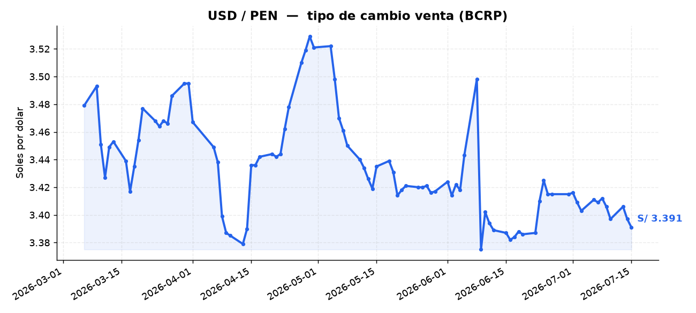

# 📈 pen-radar

**Dashboard del dólar (USD/PEN) que se actualiza solo.** Un pipeline de datos
en Python que descarga el tipo de cambio **oficial del BCRP** (Banco Central de
Reserva del Perú), lo procesa, guarda el histórico, genera un gráfico y reescribe
este mismo README — **sin intervención humana**, todos los días, gracias a
GitHub Actions.

> Cada punto del gráfico de abajo y cada commit con el mensaje
> `chore: actualiza datos` los generó el robot solo. No los subí a mano.

---

<!--DATA:START-->

### 💵 Dólar hoy: **S/ 3.391**  🔻 -0.18%

_Última actualización: 2026-07-15 (automática vía GitHub Actions)_

| Métrica | Valor |
|---|---|
| Tipo de cambio actual | S/ 3.3910 |
| Variación vs. día anterior | -0.0060 (-0.18%) |
| Tendencia | bajando |
| Mínimo (30 días) | S/ 3.3750 |
| Máximo (30 días) | S/ 3.4980 |
| Promedio (30 días) | S/ 3.4064 |



<!--DATA:END-->

---

## ¿Por qué este proyecto?

Es un ejemplo pequeño pero **completo** de un problema real de ingeniería de
datos: extraer, transformar, almacenar, visualizar y **automatizar**. Muestra el
ciclo entero funcionando en producción, no un notebook suelto.

## Cómo funciona

```
 API del BCRP ──▶ fetch.py ──▶ storage.py ──▶ analyze.py ──▶ chart.py ──▶ readme.py
  (serie oficial)  (extrae)    (CSV, 1 día    (estadísticas)  (gráfico   (reescribe
                                = 1 fila)                       PNG)       el README)
```

Todo lo orquesta `src/main.py`. En cada corrida se piden los últimos ~180 días y
se fusionan con el histórico (upsert por día): el sistema se auto-rellena y se
auto-corrige. Si la API se cae, el pipeline **no borra nada**: reutiliza el
histórico guardado para regenerar las salidas.

| Archivo | Rol |
|---|---|
| `src/fetch.py` | Descarga la serie de tipo de cambio del BCRP (venta, diaria). |
| `src/storage.py` | Guarda el histórico en `data/history.csv` (sin duplicar días). |
| `src/analyze.py` | Calcula variación diaria, min/máx/promedio de 30 días y tendencia. |
| `src/chart.py` | Dibuja el gráfico de los últimos 90 días. |
| `src/readme.py` | Reescribe el bloque de datos de este README. |
| `.github/workflows/update.yml` | Corre todo cada día y hace commit del resultado. |

## Correlo tú mismo

```bash
python -m venv .venv
# Windows:
.venv\Scripts\activate
# Linux/Mac:
source .venv/bin/activate

pip install -r requirements.txt
python src/main.py
```

## Stack

Python · pandas · matplotlib · requests · GitHub Actions

## Automatización

El workflow de `.github/workflows/update.yml` se dispara con un `cron` diario
(y también se puede lanzar a mano desde la pestaña **Actions**). Cada corrida:

1. Instala dependencias.
2. Ejecuta el pipeline.
3. Hace commit y push del CSV, el gráfico y el README actualizados.

## Fuente de datos

Banco Central de Reserva del Perú (BCRP) — serie `PD04640PD`, *"Tipo de cambio
- TC Sistema bancario SBS (S/ por US$) - Venta"*. API pública y gratuita.

---

_Proyecto de portafolio de **Arian Casas** — Ingeniería de Sistemas · automatización + datos._
